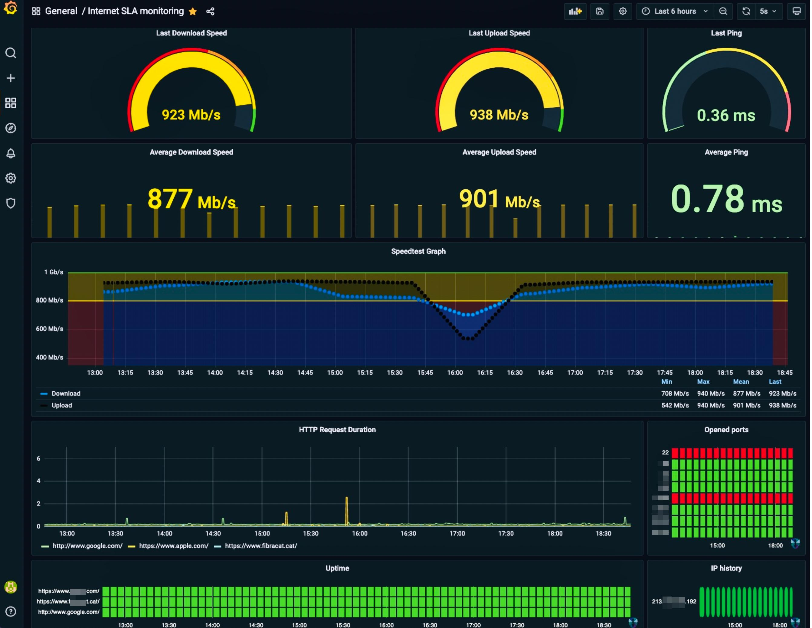

# Internet Service Level Agreement Monitoring Docker Stack with Prometheus, Grafana and a small python ports checker.

> To learn more about the python ports checker use, please visit the related python project [here](https://github.com/xeviff/pyOpenPortsChecker4Prometheus) 

Stand-up a Docker [Prometheus](http://prometheus.io/) stack containing Prometheus, Grafana with [blackbox-exporter](https://github.com/prometheus/blackbox_exporter), and [speedtest-exporter](https://github.com/MiguelNdeCarvalho/speedtest-exporter) to collect and graph home Internet reliability and throughput.

## This is a fork

Please, be aware this is an improvement based on an already existing project, so if you are interested on more details about its components, then I encourage you to take as first reference the original project [here](https://github.com/geerlingguy/internet-monitoring)

## Configurations

That's easy, check the both projects configuration steps :wink:
Another important thing is the threshold for the internet speed. In my case I should have 1GB symmetrical and if one day I'll have this real speed, the colors would get the green color (but I don't expect this will happen with fibracat.cat :triumph:). Anyway if you had 600 Mbps for example, you'd need to adjust the Grafana's dashboard thresholds to have the green color when the values reaches 600 instead of 1000.
But it's pretty easy, you (as grafana's administrator) edit the panels and change these values:

## Expected result

This is how it looks like in my NAS:

 
The interesting thing is you can adjust the time visibility and get its average, for example the last 24h or even last week stats, etc.
