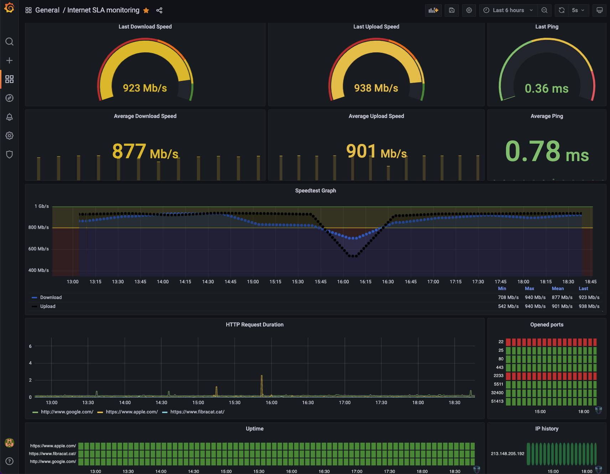

# Internet Service Level Agreement Monitoring Docker Stack with Prometheus, Grafana and a little python ports checker

> To learn more about the python ports checker use, please visit this page: https://github.com/xeviff/pyOpenPortsChecker4Prometheus  

Stand-up a Docker [Prometheus](http://prometheus.io/) stack containing Prometheus, Grafana with [blackbox-exporter](https://github.com/prometheus/blackbox_exporter), and [speedtest-exporter](https://github.com/MiguelNdeCarvalho/speedtest-exporter) to collect and graph home Internet reliability and throughput.

## This is a fork

Please, be aware this is an improvement from the following forked project, so I encourage you to get it as a first reference:
https://github.com/geerlingguy/internet-monitoring

## Configurations

That's easy, check the both projects configuration steps :wink:

## Expected result

This is how it looks like in my NAS:

The interesting thing is you can adjust the time visibility and get its average, for example the last 24h or even last week stats, etc.

## Troubleshooting

If any error don't hesitate to open an Issue and I'll check if I mess up during the merge :trollface:
